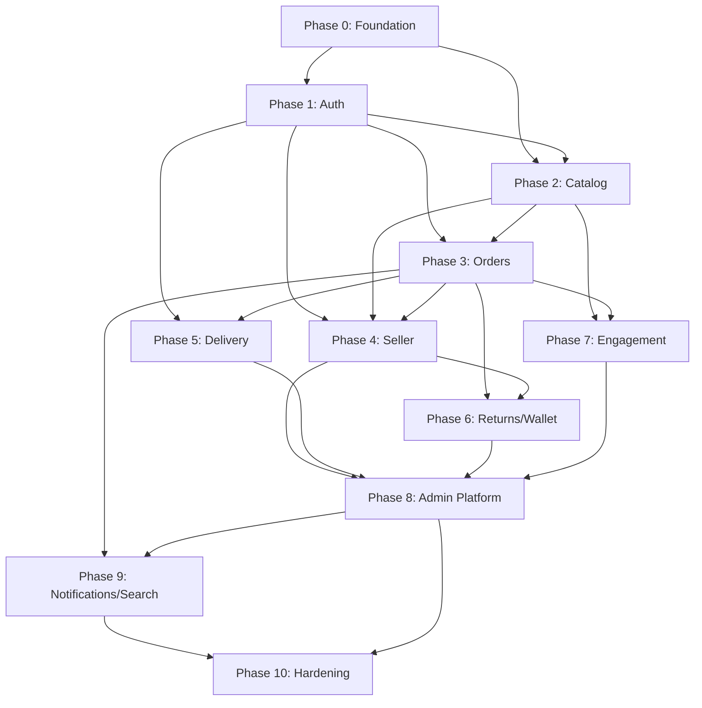

# 01 — Implementation Phases

## Phase Overview

| Phase | Name | Duration | Priority | Complexity |
|-------|------|----------|----------|------------|
| 0 | Platform Foundation | Weeks 1–2 | P0 | Medium |
| 1 | Identity & Auth | Weeks 2–3 | P0 | High |
| 2 | Catalog & CMS | Weeks 3–5 | P0 | High |
| 3 | Cart, Orders & Payments | Weeks 5–7 | P0 | Very High |
| 4 | Seller Portal Backend | Weeks 7–9 | P0 | High |
| 5 | Delivery & Logistics | Weeks 9–10 | P1 | High |
| 6 | Returns, Refunds & Wallet | Weeks 10–11 | P1 | High |
| 7 | Engagement (Reviews, Wishlist, Promotions) | Weeks 11–12 | P1 | Medium |
| 8 | Admin Platform (RBAC, Reports, Finance) | Weeks 12–15 | P0 | Very High |
| 9 | Notifications, Search & Real-time | Weeks 15–16 | P2 | Medium |
| 10 | Hardening & Production Readiness | Weeks 16–18 | P0 | Medium |

---

## Phase 0 — Platform Foundation

**Purpose:** Establish project skeleton, shared infrastructure, and development environment.

**Goals:**
- Monorepo/backend folder structure per Infrastructure Master Plan
- MongoDB connection with health checks
- Redis connection pool
- Standard API response envelope
- Global exception handler and validation layer
- Environment config management
- CI pipeline (lint, test, build)
- Docker Compose for local dev

**Dependencies:** None

**Deliverables:**
- `backend/` project scaffold
- Shared utilities: `ApiResponse`, `AppError`, `asyncHandler`
- Health endpoints: `GET /health`, `GET /ready`
- Logging (Winston/Pino) with request correlation IDs
- OpenAPI/Swagger stub at `/api/docs`

**Modules Included:** Core Platform

**Completion Criteria:**
- Server starts, connects to MongoDB + Redis
- Standard 404/500 error responses
- CI green on empty test suite

**Risks:** Environment misconfiguration → mitigate with `.env.example` + validation on boot

**Testing Strategy:** Smoke tests for health endpoints; config validation unit tests

---

## Phase 1 — Identity & Auth

**Purpose:** Replace all localStorage auth flags with production JWT-based authentication for all four portals.

**Goals:**
- Customer OTP auth (phone + email)
- Seller email/password auth
- Admin email/password auth + permission payload
- Delivery partner phone OTP auth
- Refresh token rotation
- Session/device management

**Dependencies:** Phase 0

**Deliverables:**
- Auth module for each portal
- OTP service with rate limiting (5/min, 6-digit, 5-min expiry)
- JWT access (15 min) + refresh (7 days) tokens
- Password hashing (bcrypt, cost 12) for seller/admin
- Middleware: `authenticate`, `authorize`, `requirePermission`
- Token blacklist in Redis on logout

**Modules Included:** Customer Auth, Seller Auth, Admin Auth, Delivery Auth, OTP Service, Session Service

**Frontend Routes Covered:**
- `/login`, `/signup`, `/forgot-password`
- `/seller/login`
- `/admin/auth`
- `/delivery/auth`, `/delivery/signup`

**Completion Criteria:**
- All four portals authenticate via API
- Refresh flow works without re-login
- Invalid/expired tokens return 401
- OTP rate limit enforced

**Risks:** SMS gateway downtime → queue OTP retries; fallback email OTP

**Testing Strategy:** Auth integration tests per portal; OTP expiry/rate-limit tests; token refresh tests

---

## Phase 2 — Catalog & CMS

**Purpose:** Power product browsing, category navigation, home sections, and storefront CMS.

**Goals:**
- Category tree CRUD (admin) + public read
- Product catalog with variants, images, moderation workflow
- Home sections, banners, category chips
- Commerce flow tagging (standard, mithilak, quick_shop, fresh_grocery)
- File upload to S3 with pre-signed URLs
- Legal pages CMS (terms, privacy, shipping, cancellation)

**Dependencies:** Phase 0, Phase 1 (admin auth for CMS)

**Deliverables:**
- Catalog module (categories, products, variants)
- CMS module (banners, chips, home sections, legal pages)
- Upload service (S3 pre-signed POST)
- Product moderation queue (pending → approved/rejected)
- Seed data script for categories

**Modules Included:** Catalog, CMS, File Storage, Category Service, Product Service

**Frontend Routes Covered:**
- `/home`, `/products`, `/product-detail`, `/categories`, `/category-products`
- `/search`, `/menu`, `/deals`, `/all-offers`
- `/toys`, `/beauty`, `/continue-shopping/:productId`
- `/quick-shop`, `/quick-shop/category`, `/mithilak`, `/mithilak/category`, `/fresh-grocery`, `/fresh-grocery/category`
- `/terms`, `/privacy`, `/cancellation-returns`, `/shipping`
- Admin: `/admin/categories`, `/admin/storefront/*`, `/admin/products/moderation`, `/admin/content/legal`

**Completion Criteria:**
- Product list/detail APIs with pagination, filters, search
- Home page sections API returns curated products per section key
- Admin can CRUD banners, chips, sections
- Product images served via CDN URLs

**Risks:** Large image uploads → enforce 5MB limit, async processing queue for thumbnails

**Testing Strategy:** Catalog CRUD tests; moderation workflow tests; upload MIME validation tests

---

## Phase 3 — Cart, Orders & Payments

**Purpose:** Core commerce engine — cart sync, order placement, payment processing, inventory reservation.

**Goals:**
- Server-side cart (guest merge on login)
- Multi-step checkout validation
- Order creation with atomic inventory deduction
- Payment gateway integration (Razorpay: UPI, Card, COD, Wallet)
- Order status machine
- Tax and delivery charge calculation
- Coupon application at checkout

**Dependencies:** Phase 1, Phase 2

**Deliverables:**
- Cart module
- Order module with status state machine
- Payment module with webhook handler
- Pricing engine (subtotal, discount, tax, delivery)
- Inventory reservation service
- Order confirmation notifications (queued)

**Modules Included:** Cart, Order, Payment, Pricing, Inventory Reservation, Tax Service

**Frontend Routes Covered:**
- `/cart`, `/bag`, `/checkout`
- `/profile/orders`, `/profile/orders/:orderId`
- Admin: `/admin/orders`, `/admin/orders/:orderId`
- Admin: `/admin/finance/tax`, `/admin/finance/delivery-charges`

**Completion Criteria:**
- End-to-end order placement with payment verification
- Stock decremented atomically on order confirm
- COD orders created without payment gateway call
- Wallet payment debits user wallet
- Order timeline events recorded

**Risks:** Payment webhook failures → idempotent handler + reconciliation job; stock overselling → MongoDB transactions

**Testing Strategy:** Order flow integration tests; payment webhook mock tests; concurrent stock deduction tests

---

## Phase 4 — Seller Portal Backend

**Purpose:** Complete seller API layer matching all 40+ sellerApi.js stubs.

**Goals:**
- Seller dashboard stats
- Product CRUD with seller scoping
- Order management and status updates
- Inventory management with stock history
- Return approve/reject
- Customer list (seller's buyers)
- Seller coupons, analytics, earnings, settings

**Dependencies:** Phase 1 (seller auth), Phase 2 (products), Phase 3 (orders)

**Deliverables:**
- All seller endpoints per `sellerApi.js`
- Seller-scoped query middleware
- Product duplicate endpoint
- Inventory history audit trail
- Seller notification feed

**Modules Included:** Seller Dashboard, Seller Products, Seller Orders, Seller Inventory, Seller Returns, Seller Customers, Seller Coupons, Seller Analytics, Seller Earnings, Seller Settings

**Frontend Routes Covered:**
- All `/seller/*` routes (16 routes)

**Completion Criteria:**
- Every sellerApi.js TODO replaced with live endpoint
- Seller can only access own products/orders/customers
- Dashboard stats accurate within 5-min cache window

**Risks:** Cross-seller data leak → mandatory `sellerId` filter in repository layer

**Testing Strategy:** Seller isolation tests; CRUD tests per resource; analytics aggregation tests

---

## Phase 5 — Delivery & Logistics

**Purpose:** Last-mile delivery operations with OTP-verified handoff.

**Goals:**
- Delivery partner registration + admin approval
- Online/offline status toggle
- Order assignment (auto + manual)
- Pickup and delivery OTP generation/verification
- Earnings tracking per delivery
- GPS location updates (optional Phase 5.1)

**Dependencies:** Phase 1 (delivery auth), Phase 3 (orders)

**Deliverables:**
- Delivery partner module
- Assignment engine
- OTP service for pickup/delivery
- Delivery earnings ledger
- Admin delivery management APIs

**Modules Included:** Delivery Partner, Delivery Assignment, Delivery OTP, Delivery Earnings

**Frontend Routes Covered:**
- All `/delivery/*` routes (11 routes)
- Admin: `/admin/delivery/all`, `/admin/delivery/approval`

**Completion Criteria:**
- Partner accepts order → status updates propagate to customer/seller/admin
- Delivery OTP single-use, 10-min expiry
- Earnings credited on confirmed delivery

**Risks:** No available partners → assignment retry queue with escalation to admin

**Testing Strategy:** Assignment workflow tests; OTP validation tests; earnings calculation tests

---

## Phase 6 — Returns, Refunds & Wallet

**Purpose:** Post-purchase operations — returns workflow, refund processing, wallet ledger.

**Goals:**
- Customer return initiation with image upload
- Seller/admin return approval chain
- Refund to wallet or original payment source
- Wallet credit/debit with transaction history
- Platform refund reports

**Dependencies:** Phase 3 (orders), Phase 4 (seller returns)

**Deliverables:**
- Returns module
- Refunds module
- Wallet ledger module
- Refund reconciliation job

**Modules Included:** Returns, Refunds, Wallet

**Frontend Routes Covered:**
- `/profile/orders/:orderId` (return action)
- `/wallet`
- Seller: `/seller/returns`
- Admin: `/admin/operations/returns`, `/admin/operations/refunds`
- Admin: `/admin/reports/refunds`

**Completion Criteria:**
- Return → approve → refund chain completes atomically
- Wallet balance always equals sum of transactions
- Refund to source requires payment gateway API call

**Risks:** Double refund → idempotency keys on refund processing

**Testing Strategy:** Return/refund state machine tests; wallet ledger integrity tests

---

## Phase 7 — Engagement (Reviews, Wishlist, Promotions)

**Purpose:** User-generated content, loyalty features, and promotional engine.

**Goals:**
- Product reviews with moderation
- Product Q&A with seller/admin answers
- Wishlist sync
- Coupon engine (platform + seller scoped)
- Flash sales and featured products
- Deal pages API

**Dependencies:** Phase 2 (products), Phase 3 (orders for verified reviews)

**Deliverables:**
- Reviews module with moderation queue
- Q&A module
- Wishlist module
- Promotion module (coupons, flash sales, featured)
- Verified purchase badge on reviews

**Modules Included:** Reviews, Q&A, Wishlist, Promotions (Coupons, Flash Sales, Featured)

**Frontend Routes Covered:**
- `/wishlist`, `/profile/wishlist`, `/profile/reviews`, `/profile/questions`, `/profile/coupons`
- `/deals`, `/all-offers`
- Seller: `/seller/reviews`, `/seller/coupons`
- Admin: `/admin/promotions/*`, `/admin/content/reviews`, `/admin/content/qna`

**Completion Criteria:**
- Reviews require delivered order for same product
- Coupon validation at checkout (min order, expiry, usage limit)
- Flash sale prices override product price during active window

**Risks:** Review spam → rate limit 5 reviews/day; moderation queue

**Testing Strategy:** Review eligibility tests; coupon rule engine tests; flash sale price override tests

---

## Phase 8 — Admin Platform (RBAC, Reports, Finance)

**Purpose:** Full admin backend — user/vendor management, RBAC, finance, reports, audit.

**Goals:**
- Complete admin API per `api.js` (90+ endpoints)
- RBAC with 38 permissions across 15 groups
- Sub-admin CRUD with role assignment
- Audit logging for all admin actions
- Finance: commission rules, tax config, delivery charges, payouts
- Reports: sales, sellers, users, orders, inventory, refunds with export
- Support tickets
- Platform settings

**Dependencies:** Phase 1–7 (all domain modules)

**Deliverables:**
- All admin endpoints
- Permission middleware matrix
- Audit log service
- Report generation + CSV/PDF export
- Payout processing with dual-approval for large amounts
- Support ticket CRUD

**Modules Included:** Admin Dashboard, Admin Users, Admin Vendors, Admin Orders, Admin Finance, Admin Reports, Admin RBAC, Admin Audit, Admin Support, Admin Settings, Admin Notifications

**Frontend Routes Covered:**
- All remaining `/admin/*` routes

**Completion Criteria:**
- Every admin API stub in `api.js` functional
- Permission denied returns 403 with required permission in body
- Audit log captures actor, action, target, IP, metadata
- Reports export as downloadable blobs

**Risks:** Report query performance → pre-aggregated collections + nightly ETL job

**Testing Strategy:** RBAC matrix tests (each permission); audit log verification; report accuracy tests

---

## Phase 9 — Notifications, Search & Real-time

**Purpose:** Multi-channel notifications, full-text search, live order tracking.

**Goals:**
- Push (FCM), SMS, email notification channels
- Notification templates per locale (en, hi, bn, mai)
- User notification preferences
- Full-text product search (Atlas Search or Elasticsearch)
- WebSocket/SSE for order tracking
- Admin broadcast notifications

**Dependencies:** Phase 3 (orders), Phase 8 (admin notifications)

**Deliverables:**
- Notification service with BullMQ workers
- Template engine with i18n
- Search index sync on product CRUD
- WebSocket gateway for order status
- FCM device token registration

**Modules Included:** Notification Service, Search Service, Real-time Gateway

**Frontend Routes Covered:**
- `/profile/notifications` (settings)
- `/profile/orders/:orderId` (live tracking)
- `/search` (full-text)
- Admin: `/admin/comms/notifications`
- All portal notification feeds

**Completion Criteria:**
- Order status change triggers push + SMS within 30s
- Search returns relevant results < 200ms p95
- WebSocket delivers status updates to connected clients

**Risks:** Notification provider rate limits → queue with backoff; search index lag → event-driven sync

**Testing Strategy:** Notification delivery tests (mock providers); search relevance tests; WebSocket connection tests

---

## Phase 10 — Hardening & Production Readiness

**Purpose:** Security hardening, performance optimization, monitoring, frontend integration.

**Goals:**
- Rate limiting on all public endpoints
- Security headers (Helmet), CORS whitelist
- Redis caching for hot paths
- Database index optimization
- Load testing (k6/Artillery)
- Frontend mock replacement
- Production deployment pipeline
- Runbook documentation

**Dependencies:** All prior phases

**Deliverables:**
- Rate limiter middleware (per IP + per user)
- Cache layer for categories, home sections, product detail
- CDN configuration for static assets
- Monitoring dashboards
- Production readiness checklist (see Testing Master Plan)
- Frontend integration guide

**Modules Included:** Cache Layer, Rate Limiter, Monitoring, Deployment

**Completion Criteria:**
- All 109+ routes backed by live APIs
- p95 API latency < 300ms for read endpoints
- 99.9% uptime target infrastructure
- Zero critical security findings in penetration test

**Risks:** Frontend integration regressions → contract tests against OpenAPI spec

**Testing Strategy:** Load tests; security scan; regression suite; production smoke tests

---

## Phase Dependency Graph

