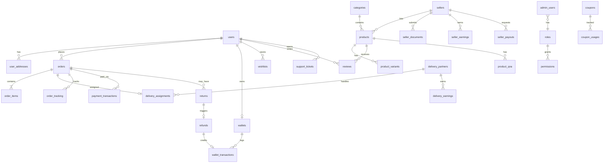

# 03 — Database Master Plan

**Database:** MongoDB 7.x (Replica Set, 3 nodes production)  
**ODM:** Mongoose  
**Strategy:** Document-oriented with embedded snapshots where appropriate; references for cross-entity relations

---

## Collection Catalog (42 Collections)

| # | Collection | Domain | Soft Delete | Versioning | Audit History |
|---|------------|--------|-------------|------------|---------------|
| 1 | `users` | Customer identity | ✓ deletedAt | — | profile change log |
| 2 | `user_addresses` | Addresses | ✓ | — | — |
| 3 | `user_payment_methods` | Saved cards | ✓ | — | — |
| 4 | `user_devices` | FCM tokens | — | — | — |
| 5 | `otp_sessions` | OTP state | TTL 5min | — | — |
| 6 | `refresh_tokens` | JWT refresh | TTL 7d | — | — |
| 7 | `sellers` | Seller accounts | ✓ | — | status history |
| 8 | `seller_documents` | KYC docs | — | — | verification log |
| 9 | `categories` | Category tree | ✓ | — | — |
| 10 | `products` | Product catalog | ✓ | schema v1 | moderation history |
| 11 | `product_variants` | Variants | ✓ | — | — |
| 12 | `product_images` | Image metadata | — | — | — |
| 13 | `carts` | Shopping carts | TTL 30d inactive | — | — |
| 14 | `cart_items` | Cart line items | — | — | — |
| 15 | `orders` | Orders | — | status v1 | status_history embedded |
| 16 | `order_items` | Line items | — | — | — |
| 17 | `order_tracking` | Tracking events | — | — | append-only |
| 18 | `order_status_history` | Status audit | — | — | append-only |
| 19 | `payment_transactions` | Payments | — | — | append-only |
| 20 | `payment_webhooks` | Webhook log | — | — | append-only |
| 21 | `returns` | Return requests | — | — | status history |
| 22 | `refunds` | Refund records | — | — | append-only |
| 23 | `wallets` | Wallet balances | — | — | — |
| 24 | `wallet_transactions` | Wallet ledger | — | — | append-only |
| 25 | `coupons` | Coupons | ✓ | — | — |
| 26 | `coupon_usages` | Usage tracking | — | — | — |
| 27 | `flash_sales` | Flash promotions | — | — | — |
| 28 | `flash_sale_products` | Flash sale items | — | — | — |
| 29 | `featured_products` | Featured curation | — | — | — |
| 30 | `wishlists` | User wishlists | — | — | — |
| 31 | `reviews` | Product reviews | ✓ | — | moderation log |
| 32 | `product_qna` | Q&A | ✓ | — | — |
| 33 | `delivery_partners` | Delivery agents | ✓ | — | approval history |
| 34 | `delivery_assignments` | Order assignments | — | — | status history |
| 35 | `delivery_earnings` | Delivery pay | — | — | append-only |
| 36 | `delivery_locations` | GPS pings | TTL 7d | — | — |
| 37 | `banners` | Hero banners | ✓ | — | — |
| 38 | `category_chips` | Nav chips | ✓ | — | — |
| 39 | `home_sections` | Home curation | — | — | — |
| 40 | `legal_pages` | CMS legal | — | version field | version history |
| 41 | `cms_pages` | Generic CMS | — | version field | version history |
| 42 | `admin_users` | Admin accounts | ✓ | — | — |
| 43 | `roles` | RBAC roles | ✓ | — | — |
| 44 | `audit_logs` | Admin audit | — | — | immutable |
| 45 | `login_history` | Login audit | TTL 90d | — | append-only |
| 46 | `notifications` | User notifications | — | — | — |
| 47 | `notification_templates` | Templates | — | version | — |
| 48 | `notification_preferences` | User prefs | — | — | — |
| 49 | `support_tickets` | Support | — | — | message thread |
| 50 | `ticket_messages` | Ticket replies | — | — | append-only |
| 51 | `commission_rules` | Finance rules | — | version | change log |
| 52 | `tax_configs` | Tax settings | — | version | — |
| 53 | `delivery_charge_rules` | Delivery pricing | — | version | — |
| 54 | `platform_earnings` | Platform revenue | — | — | append-only |
| 55 | `seller_earnings` | Seller revenue | — | — | append-only |
| 56 | `seller_payouts` | Payout requests | — | — | status history |
| 57 | `seller_settlements` | Settlement cycles | — | — | — |
| 58 | `inventory_history` | Stock changes | — | — | append-only |
| 59 | `stock_alerts` | Low stock alerts | — | — | — |
| 60 | `report_snapshots` | Pre-aggregated reports | TTL 1yr | — | — |
| 61 | `platform_settings` | Global config | — | version | change log |
| 62 | `commerce_flows` | Flow config | — | — | — |

**Total: 62 collections**

---

## ER Relationship Diagram



---

## Key Schema Details

### users
```javascript
{
  _id, name, email, phone, countryCode, gender, dob, avatarUrl,
  authProvider: 'phone'|'email', isVerified, status: 'active'|'blocked'|'suspended',
  commerceFlowPreference, locale: 'en'|'hi'|'bn'|'mai',
  deletedAt, createdAt, updatedAt
}
```

### products
```javascript
{
  _id, sellerId, title, description, sku, price, mrp, stock,
  categoryId, status: 'pending'|'approved'|'rejected',
  images: [{ url, alt, sortOrder }],
  tags: [], commerceFlows: ['standard','mithilak','quick_shop','fresh_grocery'],
  rating, reviewCount, brand, attributes: {},
  deletedAt, createdAt, updatedAt
}
```

### orders
```javascript
{
  _id, userId, orderNumber, status, commerceFlow,
  subtotal, discount, tax, deliveryCharge, total,
  paymentMethod: 'upi'|'card'|'cod'|'wallet',
  paymentStatus: 'pending'|'paid'|'failed'|'refunded',
  addressSnapshot: { /* full address at order time */ },
  couponCode, couponDiscount,
  sellerSubOrders: [{ sellerId, items[], subtotal, status }],
  cancelledAt, deliveredAt, createdAt, updatedAt
}
```

### roles
```javascript
{
  _id, name, description,
  permissions: ['dashboard.view', 'users.edit', ...], // 38 total
  isSystem: boolean, deletedAt, createdAt
}
```

---

## Indexes

### Single-Field Indexes
| Collection | Field | Type |
|------------|-------|------|
| users | email | unique, sparse |
| users | phone + countryCode | unique, compound |
| users | status | standard |
| sellers | email | unique |
| sellers | status, kycStatus | standard |
| products | sellerId | standard |
| products | categoryId | standard |
| products | status | standard |
| products | commerceFlows | standard |
| orders | userId | standard |
| orders | status | standard |
| orders | orderNumber | unique |
| orders | createdAt | standard (desc) |
| order_items | orderId | standard |
| order_items | sellerId | standard |
| delivery_assignments | partnerId | standard |
| delivery_assignments | status | standard |
| coupons | code | unique |
| audit_logs | adminId, timestamp | compound |
| notifications | userId, isRead | compound |

### Compound Indexes
| Collection | Fields | Purpose |
|------------|--------|---------|
| products | { categoryId, status, commerceFlows } | Category product listing |
| products | { sellerId, status, createdAt } | Seller product list |
| orders | { userId, status, createdAt } | User order history |
| orders | { status, createdAt } | Admin order queue |
| order_items | { sellerId, status } | Seller order fulfillment |
| reviews | { productId, status, createdAt } | Product reviews page |
| wallet_transactions | { walletId, createdAt } | Wallet history |
| delivery_assignments | { partnerId, status, createdAt } | Partner active orders |
| coupon_usages | { couponId, userId } | Usage limit check |
| inventory_history | { productId, createdAt } | Stock history |

### Text Indexes
| Collection | Fields | Weights |
|------------|--------|---------|
| products | title, description, tags, brand | title:10, tags:5, brand:3, description:1 |

---

## Atomic Transactions

| Operation | Collections Involved | Isolation |
|-----------|---------------------|-----------|
| Place order | orders, order_items, products (stock), carts, payment_transactions | Serializable |
| Cancel order | orders, order_items, products (stock restore) | Serializable |
| Process refund | refunds, wallet_transactions, wallets, orders | Serializable |
| Wallet debit (checkout) | wallets, wallet_transactions | Serializable |
| Seller payout | seller_payouts, seller_earnings | Serializable |
| Set default address | user_addresses (unset + set) | Read committed |
| Coupon apply + order | orders, coupon_usages, coupons | Serializable |
| Approve return + refund | returns, refunds, wallet_transactions | Serializable |

---

## Soft Delete Strategy

Collections with `deletedAt` field: users, sellers, products, categories, coupons, reviews, banners, category_chips, admin_users, roles.

- Queries default filter: `{ deletedAt: null }`
- Admin can view deleted records with `?includeDeleted=true`
- Hard delete after 90 days via scheduled archival job

---

## Audit History

| Entity | Mechanism |
|--------|-----------|
| Admin actions | `audit_logs` collection (immutable) |
| Order status | `order_status_history` embedded array |
| Product moderation | `moderationHistory[]` embedded |
| Seller status | `statusHistory[]` embedded |
| Legal/CMS pages | Version field + previous versions in `cms_page_versions` |
| Commission/tax rules | `changeLog[]` embedded |
| Login events | `login_history` with TTL |

---

## Data Validation

- Mongoose schema validation at ODM layer
- Joi/Zod validation at API layer (mirrors frontend rules from audit doc 14)
- Business rule validation in service layer
- Database-level unique constraints on email, phone, orderNumber, coupon code

---

## Performance Optimization

| Strategy | Application |
|----------|-------------|
| Read replicas | Reports, analytics, search queries |
| Projection | List endpoints return minimal fields |
| Aggregation pipelines | Dashboard stats, seller analytics, reports |
| TTL indexes | otp_sessions, refresh_tokens, delivery_locations, report_snapshots |
| Partial indexes | `{ status: 'pending' }` on products for moderation queue |
| Bucket pattern | order_tracking events grouped by orderId |

---

## Archival Strategy

| Data | Retention (Online) | Archive |
|------|-------------------|---------|
| audit_logs | 90 days | S3 cold storage (7 years) |
| login_history | 90 days | Delete |
| delivery_locations | 7 days | Delete |
| report_snapshots | 1 year | S3 |
| order_tracking | 2 years | Compressed archive |
| payment_webhooks | 1 year | S3 |
| Soft-deleted records | 90 days | Hard delete |

---

## Migration Strategy

1. Versioned migration scripts in `backend/migrations/`
2. Each migration: up/down functions
3. Seed scripts for: roles, permissions, default admin, categories, commerce flows
4. Zero-downtime migrations via blue-green deployment
