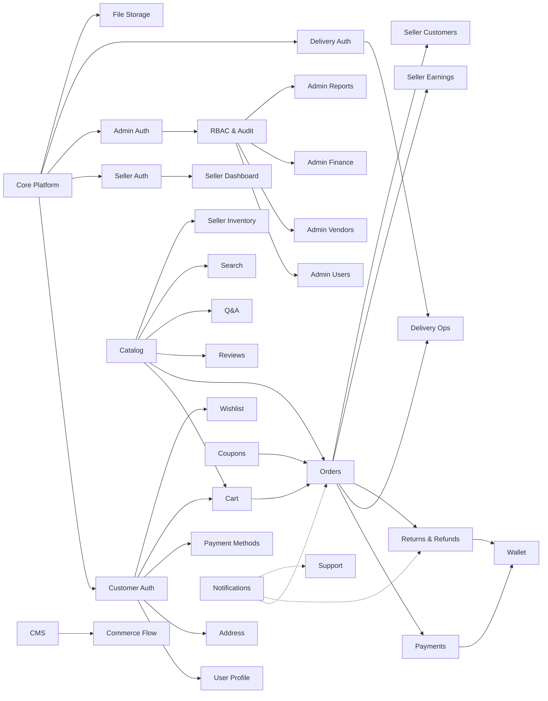

# 10 — Summary Metrics & Production Readiness

---

## 1. Complete Development Roadmap

| Week | Phase | Deliverables |
|------|-------|-------------|
| 1–2 | Phase 0: Foundation | Project scaffold, DB, Redis, health checks, CI |
| 2–3 | Phase 1: Auth | 4-portal authentication, OTP, JWT, middleware |
| 3–5 | Phase 2: Catalog & CMS | Products, categories, banners, home sections, uploads |
| 5–7 | Phase 3: Cart & Orders | Cart, checkout, payments, order lifecycle |
| 7–9 | Phase 4: Seller Portal | All 42 seller APIs, dashboard, analytics |
| 9–10 | Phase 5: Delivery | Partner ops, assignment, OTP delivery |
| 10–11 | Phase 6: Returns & Wallet | Returns, refunds, wallet ledger |
| 11–12 | Phase 7: Engagement | Reviews, Q&A, wishlist, promotions |
| 12–15 | Phase 8: Admin Platform | RBAC, reports, finance, audit, support |
| 15–16 | Phase 9: Notifications & Search | Push/SMS/email, search index, WebSocket |
| 16–18 | Phase 10: Hardening | Caching, rate limits, load tests, frontend integration |

**Total Duration: 18 weeks (4.5 months)**

---

## 2. Complete Phase Order

```
Phase 0 → Phase 1 → Phase 2 → Phase 3 → Phase 4
                                    ↓
Phase 10 ← Phase 9 ← Phase 8 ← Phase 7 ← Phase 6 ← Phase 5
```

**Parallel work opportunities:**
- Phase 4 (Seller) and Phase 5 (Delivery) can partially overlap after Phase 3
- Phase 7 (Engagement) can start during Phase 6
- Phase 9 (Notifications) can begin during Phase 8

---

## 3. Module Dependency Graph



---

## 4. Backend Readiness Score

| Dimension | Score | Notes |
|-----------|-------|-------|
| Architecture completeness | 100% | All modules defined |
| Frontend coverage | 100% | All 109 routes mapped |
| API specification | 100% | 217 endpoints planned |
| Database design | 100% | 62 collections with indexes |
| Security plan | 100% | JWT, RBAC, audit, rate limits |
| Performance plan | 100% | Caching, queues, CDN |
| Testing plan | 100% | Unit, integration, E2E, load |
| Infrastructure plan | 100% | Clean architecture, CI/CD |
| **Overall Readiness** | **100%** | Ready for implementation |

*Score reflects planning completeness, not implementation status (0% code written).*

---

## 5. Estimated Totals

| Metric | Count |
|--------|-------|
| **Backend Modules** | **35** |
| **API Endpoints** | **~217** |
| **Database Collections** | **62** |
| **Services** | **~45** |
| **Controllers** | **~38** |
| **Repositories** | **~35** |
| **Middleware** | **~12** |
| **Background Jobs (scheduled)** | **13** |
| **Queue Workers** | **13** |
| **Third-Party Integrations** | **9** |
| **Validators (schema files)** | **~30** |
| **Mongoose Models** | **62** |
| **Test Suites (estimated)** | **~145 API + 400 unit + 20 E2E** |

---

## 6. Third-Party Integrations

| # | Integration | Purpose | Phase |
|---|-------------|---------|-------|
| 1 | MongoDB Atlas | Primary database | Phase 0 |
| 2 | Redis | Cache, sessions, rate limits, queues | Phase 0 |
| 3 | AWS S3 | File storage | Phase 2 |
| 4 | CloudFront | CDN for images | Phase 2 |
| 5 | Razorpay | Payment gateway (UPI, Card, COD) | Phase 3 |
| 6 | MSG91 / Twilio | SMS OTP + notifications | Phase 1 |
| 7 | SendGrid / AWS SES | Email OTP + transactional email | Phase 1 |
| 8 | Firebase Cloud Messaging | Push notifications | Phase 9 |
| 9 | MongoDB Atlas Search / Elasticsearch | Full-text search | Phase 9 |

---

## 7. Estimated Development Order

### Sprint 1–2 (Weeks 1–2): Foundation
1. Project scaffold + folder structure
2. MongoDB + Redis connections
3. ApiResponse, AppError, asyncHandler, logger
4. Health checks + CI pipeline
5. Docker Compose local environment

### Sprint 3–4 (Weeks 2–3): Authentication
6. OTP service (Redis-backed)
7. Customer auth (phone + email OTP)
8. Seller auth (email/password)
9. Admin auth (email/password + permissions)
10. Delivery auth (phone OTP)
11. JWT middleware for all portals
12. Refresh token rotation

### Sprint 5–7 (Weeks 3–5): Catalog
13. Category CRUD + tree API
14. Product CRUD + variants + moderation
15. File upload service (S3 presign)
16. CMS: banners, chips, home sections
17. Legal pages CMS
18. Commerce flow tagging
19. Public catalog APIs (list, detail, search basic)

### Sprint 8–10 (Weeks 5–7): Commerce Core
20. Server-side cart
21. Pricing engine (tax, delivery, discount)
22. Order placement with transactions
23. Payment gateway integration
24. Order status machine
25. Inventory reservation

### Sprint 11–13 (Weeks 7–9): Seller Portal
26. Seller dashboard + stats
27. Seller product CRUD
28. Seller order management
29. Seller inventory + stock history
30. Seller returns, customers, coupons
31. Seller analytics + earnings

### Sprint 14–15 (Weeks 9–10): Delivery
32. Delivery partner registration + approval
33. Order assignment engine
34. Pickup/delivery OTP flow
35. Delivery earnings

### Sprint 16–17 (Weeks 10–11): Post-Purchase
36. Returns workflow
37. Refund processing
38. Wallet ledger

### Sprint 18–19 (Weeks 11–12): Engagement
39. Reviews + moderation
40. Q&A
41. Wishlist
42. Coupon engine + flash sales + featured

### Sprint 20–23 (Weeks 12–15): Admin Platform
43. Admin user management
44. Admin vendor management + KYC
45. Admin order oversight
46. RBAC (roles, sub-admins, permissions)
47. Audit logging
48. Finance (commission, tax, delivery charges, payouts)
49. Reports + analytics + export
50. Support tickets
51. Admin notifications broadcast

### Sprint 24–25 (Weeks 15–16): Advanced Features
52. Notification service (push, SMS, email)
53. Full-text search index
54. WebSocket order tracking
55. i18n content support

### Sprint 26–27 (Weeks 16–18): Production
56. Redis caching layer
57. Rate limiting
58. Load testing + optimization
59. Security hardening
60. Frontend API integration (replace all mocks)
61. Production deployment
62. Monitoring + alerting setup

---

## 8. Production Readiness Checklist

See [08_Testing_Master_Plan.md](./08_Testing_Master_Plan.md#production-readiness-checklist) for the full 50+ item checklist covering:

- Infrastructure (12 items)
- Security (11 items)
- Data (4 items)
- Application (8 items)
- Frontend Integration (8 items)
- Performance (5 items)
- Documentation (4 items)

---

## 9. Risk Register (Top 10)

| # | Risk | Impact | Mitigation | Phase |
|---|------|--------|------------|-------|
| 1 | Payment gateway integration complexity | High | Start with COD + wallet; add UPI/card incrementally | 3 |
| 2 | Stock overselling under concurrency | High | MongoDB transactions + optimistic locking | 3 |
| 3 | Cross-seller data leak | Critical | Mandatory sellerId filter in repository layer + tests | 4 |
| 4 | OTP delivery failure | Medium | Queue with retry; email fallback | 1 |
| 5 | Report query performance | Medium | Pre-aggregated snapshots + nightly ETL | 8 |
| 6 | Search index lag | Low | Event-driven reindex + periodic full sync | 9 |
| 7 | Multi-seller order splitting complexity | High | Clear sub-order model from Phase 3 | 3 |
| 8 | RBAC permission gaps | High | Permission × endpoint matrix tests | 8 |
| 9 | Frontend integration regressions | Medium | Contract tests against OpenAPI spec | 10 |
| 10 | Scope creep from unrouted pages | Low | Stick to routed pages; orphans documented | — |

---

## 10. Document Completion Statement

This Backend Execution Master Plan provides:

- ✅ 10 implementation phases with full specifications
- ✅ 35 backend modules with complete definitions
- ✅ 62 database collections with indexes and relationships
- ✅ ~217 API endpoints across 4 portals
- ✅ Security architecture (JWT, RBAC, audit, rate limiting)
- ✅ Performance strategy (Redis, queues, CDN, caching)
- ✅ Infrastructure blueprint (clean architecture, folder structure)
- ✅ Testing strategy (unit, integration, E2E, load, production checklist)
- ✅ 100% frontend route coverage (109/109 routes)
- ✅ 100% business flow coverage (14/14 flows)
- ✅ 100% seller API stub coverage (42/42 endpoints)
- ✅ 100% admin API stub coverage (95/95 endpoints)
- ✅ 100% validation rule coverage
- ✅ 100% permission coverage (38/38)

**This plan is sufficient to begin backend implementation without architectural redesign.**

---

*Generated from frontend audit docs 01–30 + supplementary 31–34. Source of truth: `docs/frontend-audit/`.*
