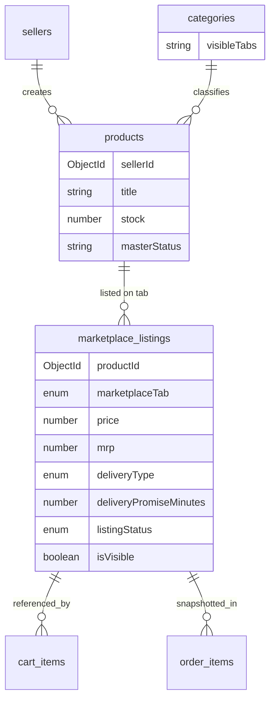

# CR-001 — Architecture Update

**Change Request:** CR-001  
**Date:** 2026-07-20  

---

## 1. Architectural Intent

Extend the approved Clean Architecture with a **listing layer** between Master Product and Customer-facing commerce. All existing layers (Presentation → Application → Domain → Infrastructure) remain. New domain concepts are added without restructuring folders.

```
┌─────────────────────────────────────────────────────────┐
│  Presentation: Routes / Controllers / Validators         │
├─────────────────────────────────────────────────────────┤
│  Application: ProductService, ListingService,            │
│               CartService, OrderService, SearchService   │
├─────────────────────────────────────────────────────────┤
│  Domain: Product (master), MarketplaceListing,           │
│          MarketplaceTab, DeliveryPromise                 │
├─────────────────────────────────────────────────────────┤
│  Infrastructure: ProductRepository,                      │
│                  MarketplaceListingRepository, MongoDB   │
└─────────────────────────────────────────────────────────┘
```

---

## 2. Domain Model (Conceptual)



---

## 3. Entity Responsibilities

### 3.1 Master Product (`products`)

**Owns:**
- Identity: title, description, SKU, brand, attributes
- Media: images
- Taxonomy: categoryId (master category)
- Inventory: `stock` (single pool per SKU)
- Master moderation: `masterStatus` (pending | approved | rejected)
- Seller ownership: `sellerId`

**Does NOT own:**
- Price per marketplace tab
- Delivery promise
- Tab visibility
- Per-tab promotions

### 3.2 Marketplace Listing (`marketplace_listings`)

**Owns:**
- Tab placement: `marketplaceTab`
- Commercial: `price`, `mrp`, optional `maxOrderQuantity`
- Visibility: `isVisible`, `listingStatus` (draft | pending | approved | rejected | suspended)
- Delivery: `deliveryType` (standard | fixed_promise), `deliveryPromiseMinutes` (15|20|25|30|null)
- Availability: `isAvailable` (computed: master stock > 0 AND listing approved AND visible)
- Promotions: references or embedded deal overrides (tab-scoped)

**Unique constraint:** `(productId, marketplaceTab, sellerId)` — one listing per product per tab per seller.

### 3.3 Category (`categories`)

**Owns:**
- `visibleTabs[]` — category appears only on selected marketplace tabs
- Applies to root categories and subcategories independently

---

## 4. Marketplace Tab Definitions

| Tab | Seller Eligibility | Delivery Type | Promise Options |
|-----|-------------------|---------------|-----------------|
| `mithilakart` | All approved sellers | Standard (location ETA) | Computed at checkout |
| `mithilak` | Admin-approved sellers only | Standard (location ETA) | Computed at checkout |
| `quick_shop` | Quick-commerce enabled sellers | Fixed promise | 15, 20, 25, 30 min (seller selects per listing) |
| `groceries_fresh` | Grocery-enabled sellers | Fixed promise | 15, 20, 25, 30 min (seller selects per listing) |

---

## 5. Cross-Cutting Concerns

### 5.1 Request Context: `marketplaceTab`

All customer catalog reads carry tab context via:
- URL path: `/storefront/:tab/...`
- Query param: `?marketplaceTab=quick_shop` (fallback)
- Header: `X-Marketplace-Tab` (optional, for API clients)

Default tab for main home: `mithilakart`.

### 5.2 Caching (extends Performance Master Plan)

| Key Pattern | TTL | Invalidation |
|-------------|-----|--------------|
| `cache:listing:{listingId}` | 5 min | Listing update |
| `cache:products:tab:{tab}:cat:{catId}:p:{page}` | 5 min | Listing/product CRUD in category |
| `cache:search:{tab}:{hash}` | 2 min | Listing change in tab |

### 5.3 Events (extends Event Bus)

| Event | Trigger | Consumers |
|-------|---------|-----------|
| `listing.created` | Seller publishes listing | Search index, admin moderation queue |
| `listing.approved` | Admin approves | Search index, storefront cache invalidation |
| `listing.updated` | Price/promise change | Cart price refresh job, cache |
| `product.stock_changed` | Inventory update | All listings availability recompute |

---

## 6. What Stays Unchanged

| Area | Reason |
|------|--------|
| JWT auth (4 portals) | Identity model independent of listings |
| RBAC permission framework | Extended with new permissions only |
| Payment gateway integration | Amount is input; source changes to listing prices |
| Wallet ledger | Financial primitive unchanged |
| Delivery OTP flow | Pickup/delivery OTP logic unchanged; SLA tracking added |
| Audit log structure | Same schema; new action types added |
| Rate limiting / metrics (Phase 10) | Infrastructure layer unchanged |
| Repository pattern + DI container | Wiring extended, not replaced |

---

## 7. Layer Additions (Minimal)

| Layer | New Artifacts |
|-------|---------------|
| Models | `MarketplaceListing.js`, `MarketplaceConfig.js` |
| Repositories | `MarketplaceListingRepository.js` |
| Services | `MarketplaceListingService.js`, `MarketplaceEngineService.js` |
| Validators | `listing.validator.js` |
| Controllers | `ListingController` (seller), `AdminListingController` |
| Routes | `/seller/listings/*`, `/admin/listings/*`, customer listing resolution |
| Constants | `marketplace.js` (tab enum, delivery promise enum) |

---

## 8. Deprecations (Post-Migration)

| Deprecated | Replacement |
|------------|-------------|
| `products.commerceFlows[]` | `marketplace_listings.marketplaceTab` |
| `products.price`, `products.mrp` on customer reads | `marketplace_listings.price`, `marketplace_listings.mrp` |
| `products.status` for tab visibility | `marketplace_listings.listingStatus` |
| `?commerceFlow=` query param | `?marketplaceTab=` |
| M35 Commerce Flow Engine | M36 Marketplace Engine |
| `commerce_flows` collection | `marketplace_config` collection |

Deprecation period: 2 release cycles after CR-2 go-live. Legacy fields retained read-only during migration.

---

## 9. Architecture Quality Gates

Before CR-001 implementation merges:

1. No customer API returns product price without active listing for requested tab
2. No order placed without `listingId` snapshot on line items
3. Quick commerce listing cannot publish without `deliveryPromiseMinutes`
4. Standard tab listing cannot set fixed promise minutes
5. Category with empty `visibleTabs[]` cannot be saved
6. Cart rejects items from different marketplace tabs

---

## 10. Related Documents

- [Database Architecture](./03_Database_Architecture.md)
- [Marketplace Architecture](./11_Marketplace_Architecture.md)
- [Module Dependency Graph](./12_Module_Dependency_Graph.md)
