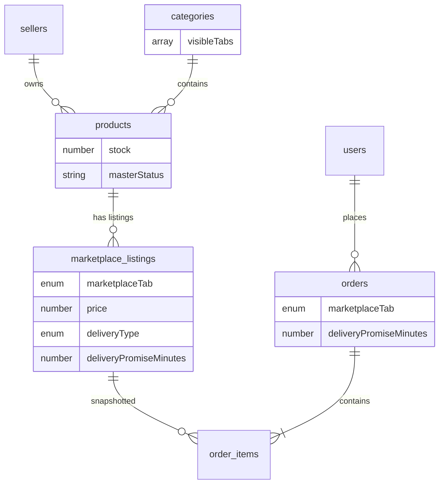

# CR-001 — Updated Database Architecture

**Change Request:** CR-001  
**Date:** 2026-07-20  
**Base:** Database Master Plan v1.0 (62 collections)  

---

## 1. Recommendation Summary

| Question | Decision |
|----------|----------|
| Should Product remain master? | **Yes** — single source for identity, media, SKU, master stock |
| Should ProductListing exist? | **No** — use `marketplace_listings` (domain-accurate name) |
| Should MarketplaceListing exist? | **Yes** — new collection `marketplace_listings` |
| Where does delivery promise live? | **`marketplace_listings.deliveryPromiseMinutes`** |
| Where does pricing live? | **`marketplace_listings.price`, `marketplace_listings.mrp`** |
| Where does inventory live? | **`products.stock`** (master pool); listing has availability flags |
| How do categories relate? | **`categories.visibleTabs[]`** — independent per category/subcategory |

---

## 2. New Collections

### 2.1 `marketplace_listings`

```javascript
{
  _id: ObjectId,
  productId: ObjectId,          // ref products — required
  sellerId: ObjectId,             // ref sellers — denormalized for isolation
  marketplaceTab: enum,           // mithilakart | mithilak | quick_shop | groceries_fresh

  // Commercial
  price: Number,                  // required, min 0
  mrp: Number,                    // required, min 0, >= price
  maxOrderQuantity: Number,       // optional cap per order

  // Visibility & moderation
  listingStatus: enum,            // draft | pending | approved | rejected | suspended
  isVisible: Boolean,             // seller toggle; default false until approved
  moderationNote: String,

  // Delivery (CR-001 core rule)
  deliveryType: enum,             // standard | fixed_promise
  deliveryPromiseMinutes: Number, // 15 | 20 | 25 | 30 — required when deliveryType=fixed_promise

  // Optional tab-specific overrides
  promotionTags: [String],        // e.g. ['bestseller', 'new']
  sortBoost: Number,              // search ranking boost per tab

  // Timestamps
  publishedAt: Date,
  approvedAt: Date,
  rejectedAt: Date,
  deletedAt: Date,
  createdAt: Date,
  updatedAt: Date
}
```

**Indexes:**
| Index | Type | Purpose |
|-------|------|---------|
| `{ productId, marketplaceTab }` | unique compound | One listing per product per tab |
| `{ sellerId, marketplaceTab, listingStatus }` | compound | Seller listing dashboard |
| `{ marketplaceTab, listingStatus, isVisible }` | compound | Customer tab browse |
| `{ productId, listingStatus }` | compound | Product detail — all tabs |

**Validation rules (DB + application):**
- `deliveryType: fixed_promise` → `deliveryPromiseMinutes` required ∈ {15,20,25,30}
- `deliveryType: standard` → `deliveryPromiseMinutes` must be null
- `marketplaceTab ∈ {quick_shop, groceries_fresh}` → `deliveryType` must be `fixed_promise`
- `marketplaceTab ∈ {mithilakart, mithilak}` → `deliveryType` must be `standard`

### 2.2 `marketplace_config`

Replaces `commerce_flows`. Platform-level tab configuration.

```javascript
{
  _id: ObjectId,
  tab: enum,                      // unique
  displayName: String,
  isActive: Boolean,
  deliveryModel: enum,            // standard | fixed_promise
  allowedPromiseMinutes: [Number], // [15,20,25,30] for quick tabs
  sellerEligibilityRule: enum,    // all_approved | mithilak_approved | quick_enabled | grocery_enabled
  minCartValue: Number,
  serviceablePincodes: [String],  // optional override list
  createdAt, updatedAt
}
```

---

## 3. Modified Collections

### 3.1 `products` (Master Product)

```javascript
{
  _id, sellerId,
  title, description, sku, brand, attributes,
  categoryId,                      // master category
  images: [{ url, alt, sortOrder }],
  tags: [],
  stock: Number,                   // master inventory pool
  masterStatus: enum,              // pending | approved | rejected  (renamed from status)
  moderationNote: String,
  rating, reviewCount,             // aggregated from reviews on master product
  deletedAt, createdAt, updatedAt

  // DEPRECATED (migration period only):
  // price, mrp, commerceFlows[], status
}
```

**Why master keeps stock:** Physical SKU is one. Aashirvaad Atta in warehouse is one unit pool; listings on different tabs share it.

**Optional future extension:** `stockAllocations: [{ tab, reservedQty }]` for dedicated quick-commerce dark-store allocation — not required for CR-001 MVP.

### 3.2 `categories`

```javascript
{
  _id, name, slug, description,
  parentId, imageUrl, iconUrl, sortOrder, isActive,
  visibleTabs: [enum],           // REPLACES commerceFlows[]
  deletedAt, createdAt, updatedAt
}
```

**Rule:** Subcategory `visibleTabs` must be subset of parent `visibleTabs` (validated at application layer).

### 3.3 `carts` / embedded cart items

```javascript
// cart document
{
  userId | sessionId,
  marketplaceTab: enum,          // cart is tab-scoped
  items: [{
    listingId: ObjectId,
    productId: ObjectId,           // denormalized
    quantity: Number,
    unitPrice: Number,             // snapshot from listing at add time
    deliveryPromiseMinutes: Number // snapshot for quick tabs
  }],
  updatedAt
}
```

**Rule:** Adding item with different `marketplaceTab` → 409 `CART_TAB_MISMATCH`.

### 3.4 `orders` / `order_items`

```javascript
// order
{
  marketplaceTab: enum,            // REPLACES commerceFlow
  deliveryType: enum,
  deliveryPromiseMinutes: Number,  // snapshot — max of line items or order-level SLA
  estimatedDeliveryAt: Date,       // computed at order time
  // ... existing fields
}

// order_item
{
  listingId: ObjectId,
  productId: ObjectId,
  listingSnapshot: {
    title, price, mrp, sku,
    deliveryPromiseMinutes,
    marketplaceTab
  },
  // ... existing fields
}
```

### 3.5 `coupons`

Add: `applicableTabs: [enum]` — empty = all tabs.

### 3.6 `flash_sale_products`

Add: `listingId` (optional) or `marketplaceTab` scope. Prefer `listingId` for precise targeting.

### 3.7 `home_sections`, `banners`, `category_chips`

Replace `commerceFlows[]` with `visibleTabs[]`.  
Product references in sections → `listingId` (or `{ productId, marketplaceTab }` pair).

### 3.8 `delivery_charge_rules`

Add: `marketplaceTab`, `deliveryType`, `promiseMinutes` (for quick SLA tiers).

### 3.9 `inventory_history`

Add: `listingId` (optional) for audit when listing availability toggled.

---

## 4. Unchanged Collections (Confirmed)

`users`, `sellers`, `user_addresses`, `payment_transactions`, `wallets`, `wallet_transactions`, `refunds`, `returns`, `reviews`, `product_qna`, `delivery_partners`, `delivery_assignments`, `roles`, `admin_users`, `audit_logs`, `notifications`, `support_tickets`, `commission_rules`, `tax_configs`, `platform_settings`

Reviews and Q&A stay on **master `productId`** — not listingId.

---

## 5. Updated ER Diagram



---

## 6. Index Strategy (New / Modified)

| Collection | Index | Purpose |
|------------|-------|---------|
| marketplace_listings | `{ marketplaceTab, listingStatus, isVisible, price }` | Tab product grid + sort |
| marketplace_listings | `{ sellerId, productId }` | Seller product detail |
| products | `{ categoryId, masterStatus }` | Admin moderation (remove commerceFlows from index) |
| products | text index unchanged | Master search; joined with listings at query time |
| orders | `{ marketplaceTab, status, createdAt }` | Tab-filtered admin reports |
| categories | `{ visibleTabs, isActive, parentId }` | Tab-scoped category tree |

---

## 7. Atomic Transactions (Updated)

| Operation | Collections | Change |
|-----------|-------------|--------|
| Place order | orders, order_items, **marketplace_listings** (availability check), products (stock) | Validate listing approved + visible + tab match |
| Seller publish listing | marketplace_listings, products | Master must be approved; listing → pending |
| Admin approve listing | marketplace_listings, audit_logs | Listing status transition |
| Stock update | products, marketplace_listings (availability recompute) | All visible listings reflect stock |

---

## 8. Collection Count

| Before CR-001 | After CR-001 |
|---------------|--------------|
| 62 | 64 (+marketplace_listings, +marketplace_config; commerce_flows deprecated) |

---

## 9. ProductListing vs MarketplaceListing

| Name | Verdict |
|------|---------|
| `product_listings` | Rejected — implies 1:1 with product; we have 1:N (one per tab) |
| `marketplace_listings` | **Approved** — aligns with business language "Marketplace Listing" |
| Embedded in product doc | Rejected — unbounded array growth; poor indexing per tab |

---

## 10. Search Index Strategy

**Phase 1 (CR-001 MVP):** Denormalized search document per active listing:

```javascript
// search_listings (optional collection or Atlas Search index source)
{
  listingId, productId, marketplaceTab,
  title, brand, tags, categoryId,
  price, rating, listingStatus, isVisible,
  deliveryPromiseMinutes
}
```

Rebuild on `listing.approved`, `product.updated`, `listing.updated`.

**Phase 2 (Scale):** Atlas Search with `marketplaceTab` facet filter.
