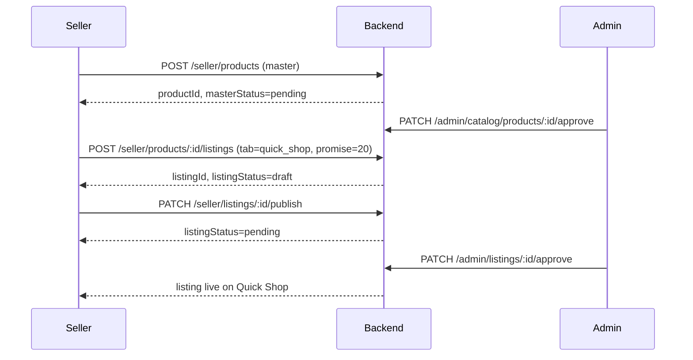

# CR-001 — Updated Seller Workflow

**Change Request:** CR-001  
**Date:** 2026-07-20  

---

## 1. Workflow Overview

Seller product management becomes a **two-stage pipeline**:

```
Stage A: Master Product (identity + inventory)
    ↓
Stage B: Marketplace Listings (per-tab commercial + delivery config)
    ↓
Publish → Admin moderation (master + listing)
    ↓
Live on selected tabs
```

---

## 2. Stage A — Create Master Product

### Steps

1. Seller navigates to **Products → Add Product**
2. Enters master fields only:
   - Title, description, SKU, brand
   - Category (must be visible on at least one eligible tab)
   - Images
   - Initial stock quantity
   - Attributes (weight, size, etc.)
3. **Does NOT enter:** price, delivery promise, tab selection at this stage (optional UX: tab selection comes next)
4. Submits → `masterStatus = pending`
5. Admin approves master → `masterStatus = approved`

### Business Rules

- SKU unique within seller account
- Category must exist and be active
- Stock ≥ 0

---

## 3. Stage B — Configure Marketplace Listings

### Steps

1. From approved (or pending) master product, seller opens **Manage Listings**
2. System shows eligible tabs based on seller profile:
   - All sellers: `mithilakart`
   - If `mithilakEligible`: `mithilak`
   - If `quickCommerceEligible`: `quick_shop`
   - If `groceryEligible`: `groceries_fresh`
3. Seller selects tabs to list on
4. For **each selected tab**, seller configures listing:

| Field | mithilakart / mithilak | quick_shop / groceries_fresh |
|-------|------------------------|------------------------------|
| Price | Required | Required |
| MRP | Required | Required |
| Delivery promise | Hidden (standard) | **Required: 15/20/25/30 min** |
| Max order qty | Optional | Optional |
| Visible after approval | Toggle (default off) | Toggle (default off) |

5. Seller saves listing → `listingStatus = draft`
6. Seller clicks **Publish** → `listingStatus = pending` (per listing)

### Validation at Publish

- Master product must be `approved`
- Category must be visible on listing's tab
- Quick tabs: delivery promise required
- Standard tabs: delivery promise must be empty
- Price > 0, MRP ≥ price

---

## 4. Admin Moderation (Dual Queue)

| Queue | Approves | Result |
|-------|----------|--------|
| Master Product Queue | Product identity, category, images | `masterStatus = approved` |
| Listing Queue | Tab-specific price, promise, visibility | `listingStatus = approved` |

Listing cannot go live until **both** master and listing are approved.

---

## 5. Post-Publish Management

### Seller Product List View

| Column | Source |
|--------|--------|
| Product title | Master |
| SKU | Master |
| Stock | Master |
| Tabs | Badge per listing status |
| Mithilakart price | Listing |
| Quick Shop promise | Listing (e.g. "20 min") |

### Edit Flows

| Edit Type | What Changes | Re-moderation |
|-----------|--------------|---------------|
| Title, images, description | Master product | Master re-approval if material |
| Stock | Master inventory | No — live listings reflect availability |
| Price on Quick Shop | Listing | Listing re-approval (configurable: auto for <10% change) |
| Delivery promise | Listing | Listing re-approval required |
| Add new tab | New listing | Full listing moderation |

---

## 6. Inventory Management

1. Seller updates stock on **master product** (existing inventory screen)
2. System recomputes availability for all approved listings:
   - `stock = 0` → all listings show out of stock
   - `stock > 0` → listings show available (if approved + visible)
3. Optional future: allocate stock per tab (not CR-001 MVP)

---

## 7. Seller Portal API Flow (Sequence)



---

## 8. Seller Dashboard Impact

- **Products count:** Master products
- **Active listings count:** Sum of approved listings across tabs
- **Orders:** Filter by marketplace tab
- **Earnings:** Split by tab in analytics
- **Low stock alerts:** Still at master product level

---

## 9. Error Scenarios

| Scenario | Seller Message |
|----------|----------------|
| Publish listing before master approved | "Product must be approved before publishing to marketplace tabs" |
| Select Mithilak without eligibility | "Your account is not approved for Mithilak marketplace" |
| Missing delivery promise on Quick Shop | "Select delivery promise: 15, 20, 25, or 30 minutes" |
| Category not visible on tab | "Category not available on selected marketplace tab" |

---

## 10. Unchanged Seller Flows

- Login / logout / password
- Order fulfillment (status updates)
- Returns handling
- Coupon creation (extended with tab scope)
- Settings / bank details
- Customer list
- Payout requests
