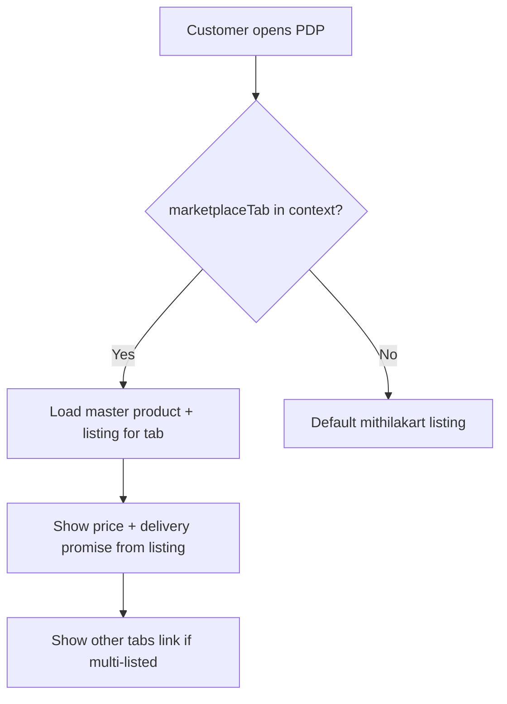
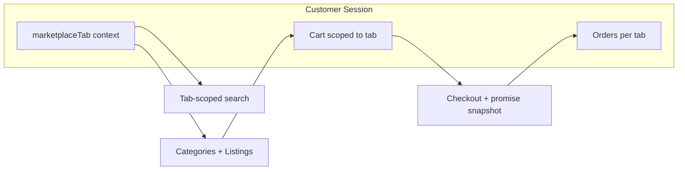

# CR-001 — Updated Customer Workflow

**Change Request:** CR-001  
**Date:** 2026-07-20  

---

## 1. Marketplace Tab Context

Customer always shops within one of four tabs. Tab context is set by:

| Entry Point | Tab |
|-------------|-----|
| `/home` | `mithilakart` |
| `/mithilak` | `mithilak` |
| `/quick-shop` | `quick_shop` |
| `/fresh-grocery` | `groceries_fresh` |

All API calls from that session include `marketplaceTab` (query, path, or header).

---

## 2. Browsing & Category Navigation

### Before (Legacy)
- Categories filtered by `commerceFlows[]` on category
- Products filtered by `commerceFlows[]` on product
- Single price on product card

### After (CR-001)
1. Customer enters tab (e.g. Quick Shop)
2. `GET /categories?marketplaceTab=quick_shop` → only categories with `visibleTabs` containing `quick_shop`
3. Customer selects category
4. `GET /categories/:id/products?marketplaceTab=quick_shop` → **listings** with:
   - Title/image from master product
   - Price from listing
   - Badge: "Delivery in 20 min" from listing promise
5. Out-of-stock: master `stock = 0` → listing shows unavailable

---

## 3. Search

1. Customer searches within tab context
2. `GET /search?q=atta&marketplaceTab=quick_shop`
3. Results return listing-aware cards (one result per listing, not per product)
4. Same master product may appear in different tabs with different prices/promises — customer sees only current tab's listing

**Default tab:** `mithilakart` if omitted.

---

## 4. Product Detail Page

**PDP displays:**
- Master: images, description, reviews, Q&A, brand, attributes
- Listing: price, MRP, discount, delivery promise, add-to-cart
- Tab switcher (optional): "Also available on Mithilakart — 2 day delivery"

---

## 5. Recommendations & Related Products

| Feature | CR-001 Behavior |
|---------|-----------------|
| Home sections | Curated **listingIds** for active tab |
| Related products | Same category, same tab, approved listings |
| Trending | Aggregated by tab |
| Recently viewed | Store `{ productId, marketplaceTab, listingId }` |
| Cross-tab recommendations | Out of scope CR-001 MVP |

---

## 6. Cart

### Rules
- One cart per customer/session **per marketplace tab**
- Switching tab with items in cart → prompt to clear or checkout first

### Add to Cart Flow
1. Customer clicks Add on PDP
2. `POST /cart/items { listingId, quantity }`
3. Backend validates:
   - Listing approved + visible
   - Master stock sufficient
   - Cart tab matches listing tab (or cart empty → set tab)
4. Cart shows delivery promise per line (quick tabs)

### Cart Display
| Field | Source |
|-------|--------|
| Product name | Master (cached) |
| Price | Listing (live or snapshot) |
| Delivery | Listing promise or standard ETA |
| Tab badge | Cart marketplaceTab |

---

## 7. Checkout

1. Validate cart homogeneous tab
2. Address selection
3. **Serviceability check** (quick tabs): pincode deliverable?
4. Pricing:
   - Line totals from listing prices
   - Delivery charge from tab-specific rules
   - Standard tabs: location-based ETA
   - Quick tabs: fixed promise countdown from order time
5. Coupon validation includes tab scope
6. Payment (unchanged gateway flow)
7. Order confirmation shows delivery promise prominently

---

## 8. Order History & Tracking

| View | Change |
|------|--------|
| Order list | Filter by tab; tab badge on each order |
| Order detail | Listing snapshots on lines; promise vs actual |
| Live tracking (SSE) | SLA countdown for quick commerce |
| Reorder | Re-adds same listingIds if still active |

---

## 9. Wishlist

- Wishlist item = `listingId` (not productId alone)
- Same product on two tabs = two wishlist entries possible
- Moving to cart preserves tab context

---

## 9. Flows Unchanged

- OTP login / registration
- Profile edit
- Address CRUD
- Wallet view
- Support tickets
- Notification preferences
- Returns initiation (references order line listing snapshot)

---

## 10. Customer Journey Example

**Aashirvaad Atta on Quick Shop:**

1. Customer opens Quick Shop tab
2. Browses Groceries category (visible on `quick_shop`)
3. Sees "Aashirvaad Atta 5kg — ₹249 — **Delivery in 20 min**"
4. Opens PDP — promise shown from listing
5. Adds to cart — cart scoped to `quick_shop`
6. Checkout — pincode serviceability verified
7. Order placed — `deliveryPromiseMinutes: 20` snapshotted
8. Tracking shows countdown SLA

**Same product on Mithilakart (separate session):**

1. Customer opens main home (`mithilakart`)
2. Same product shows "₹255 — Delivery in 2-3 days" (standard ETA)
3. Separate cart, separate checkout, separate order

---

## 11. API Context Diagram

