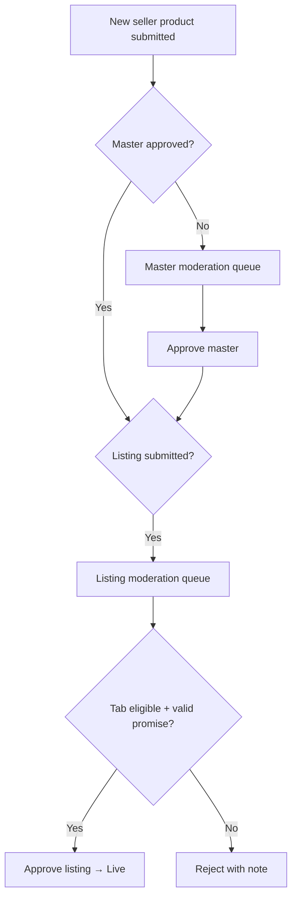

# CR-001 — Updated Admin Workflow

**Change Request:** CR-001  
**Date:** 2026-07-20  

---

## 1. Overview

Admin workflows gain **listing moderation** and **tab visibility management** alongside existing master product moderation. No changes to admin auth, RBAC framework, or user management core.

---

## 2. Category Management

### Create / Edit Category

| Field | CR-001 Change |
|-------|---------------|
| Name, slug, parent, image | Unchanged |
| `commerceFlows[]` | **Replaced by `visibleTabs[]`** |
| Active flag | Unchanged |

### Admin UI Behavior

- Multi-select checkboxes: Mithilakart, Mithilak, Quick Shop, Groceries & Fresh
- At least one tab required
- Subcategory inherits parent tabs as maximum set (can subset)
- Preview: "Visible on: Quick Shop, Groceries"

### API

```
PUT /admin/catalog/categories/:id
{ "visibleTabs": ["mithilakart", "quick_shop"] }
```

---

## 3. Subcategory Management

Same as category — independent `visibleTabs[]` with subset validation against parent.

---

## 4. Marketplace Visibility (New Admin Area)

**Path:** `/admin/marketplace/config`

| Action | Description |
|--------|-------------|
| View tab config | Delivery model, eligibility rules, min cart |
| Enable/disable tab | Platform-wide tab toggle |
| Manage serviceability | Pincode zones per quick tab |
| SLA rules | Grace period, escalation thresholds |

---

## 5. Product & Listing Approval

### Dual Moderation Queues

| Queue | Route | Actions |
|-------|-------|---------|
| Master Products | `/admin/catalog/products` | Approve/reject identity, images, category |
| Marketplace Listings | `/admin/listings` | Approve/reject price, promise, tab placement |

### Listing Approval Checklist (Admin)

- [ ] Master product approved
- [ ] Category visible on listing tab
- [ ] Price reasonable (MRP ≥ price)
- [ ] Quick tab: valid promise minutes
- [ ] Standard tab: no promise set
- [ ] Seller eligible for tab (especially Mithilak)

### Bulk Actions

- Bulk approve listings (max 100)
- Bulk suspend listings for policy violation

---

## 6. Seller Approval & Tab Eligibility

### Existing (Unchanged)
- KYC document review
- Seller activate/suspend

### New
| Action | API | Effect |
|--------|-----|--------|
| Grant Mithilak access | `PATCH /admin/vendors/:id/mithilak-eligible` | Seller can create `mithilak` listings |
| Grant Quick Shop access | `PATCH /admin/vendors/:id/quick-commerce-eligible` | Quick Shop listings |
| Grant Groceries access | `PATCH /admin/vendors/:id/grocery-eligible` | Groceries listings |
| Revoke tab access | Same endpoints `false` | Existing approved listings → suspended |

**Audit:** All eligibility changes logged in `audit_logs`.

---

## 7. Delivery Rules Admin

### Standard Tabs (Mithilakart, Mithilak)

| Config | Location |
|--------|----------|
| Pincode zones | `delivery_charge_rules` + `marketplaceTab` |
| ETA ranges | Rule-based (e.g. metro 2-day, tier-2 3-5 day) |
| Free shipping thresholds | Per tab in `marketplace_config` |

### Quick Tabs (Quick Shop, Groceries)

| Config | Location |
|--------|----------|
| Allowed promises | 15/20/25/30 min (platform default) |
| Serviceable pincodes | `marketplace_config.serviceablePincodes` |
| SLA grace period | Platform setting (default 5 min) |
| SLA breach escalation | Notification to ops |

---

## 8. Reports & Analytics

All commerce reports gain **marketplace tab** filter and dimension:

| Report | New Dimension |
|--------|---------------|
| Sales | GMV by tab |
| Orders | Count by tab |
| Sellers | Active listings per tab |
| Inventory | Master stock + listing availability |
| Refunds | By tab |
| **New:** SLA Compliance | Quick tabs — % on-time delivery |

Export CSV includes `marketplaceTab` column.

---

## 9. CMS / Storefront Admin

| Entity | Change |
|--------|--------|
| Banners | `visibleTabs[]` |
| Category chips | `visibleTabs[]` |
| Home sections | Tab-scoped; product refs → listingIds |
| Featured products | Per-tab curation |

---

## 10. Inventory Admin View

- View master stock per product
- View listing availability matrix (product × tab)
- Force-suspend listing without affecting master product

---

## 11. New Permissions Required

| Permission | Used For |
|------------|----------|
| `listings.view` | Listing moderation queue |
| `listings.approve` | Approve/reject listings |
| `listings.suspend` | Suspend live listing |
| `marketplace.manage` | Tab config |
| `marketplace.serviceability` | Pincode zone management |

Assign to Catalog Manager and Super Admin roles.

---

## 12. Unchanged Admin Workflows

- User block/suspend
- Order status override
- Refund approval
- Payout processing
- RBAC role CRUD
- Support ticket handling
- Audit log viewing
- Platform settings (commission, tax)
- Coupon CRUD (extended with tab scope only)

---

## 13. Admin Workflow Diagram


