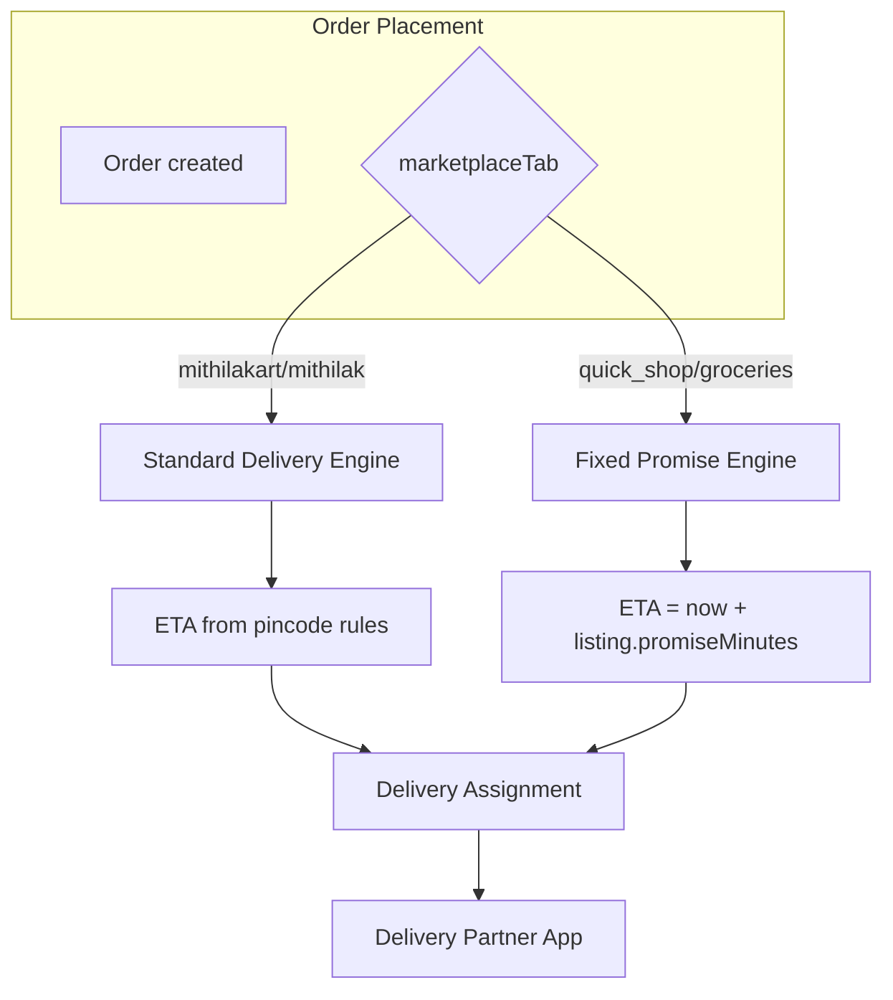

# CR-001 — Updated Delivery Workflow

**Change Request:** CR-001  
**Date:** 2026-07-20  

---

## 1. Two Delivery Architectures

CR-001 introduces **dual delivery models** determined by marketplace tab, not product:

| Model | Tabs | Promise Source | Fulfillment |
|-------|------|----------------|-------------|
| **Standard Delivery** | `mithilakart`, `mithilak` | Location-based ETA at checkout | Existing hub/courier model |
| **Fixed Promise Delivery** | `quick_shop`, `groceries_fresh` | Listing `deliveryPromiseMinutes` | Hyperlocal / dark-store model |

---

## 2. Standard Delivery (Mithilakart & Mithilak)

### Promise Calculation

```
estimatedDeliveryAt = checkoutTime + ETA(pincode, marketplaceTab, delivery_charge_rules)
```

- No `deliveryPromiseMinutes` on listing
- Customer sees range: "Delivery by Tue, 22 Jul" or "2-3 business days"
- Delivery charge from `delivery_charge_rules` filtered by `marketplaceTab`

### Order Fields

```javascript
{
  marketplaceTab: 'mithilakart',
  deliveryType: 'standard',
  deliveryPromiseMinutes: null,
  estimatedDeliveryAt: Date,      // computed range max
  deliveryCharge: Number
}
```

### Delivery Partner Flow

Unchanged from Phase 5:
1. Order confirmed → assignment created
2. Partner accepts → pickup OTP
3. Partner picks up → shipped
4. Out for delivery → delivery OTP
5. Delivered

**SLA tracking:** Soft target from `estimatedDeliveryAt`; no hard countdown.

---

## 3. Fixed Promise Delivery (Quick Shop & Groceries)

### Promise Source

**CR-001 rule:** Promise comes from **Marketplace Listing**, snapshotted at order time.

```
estimatedDeliveryAt = orderConfirmedAt + listing.deliveryPromiseMinutes
```

Example: Listing promise = 20 min → order at 10:00 → deliver by 10:20.

### Order Fields

```javascript
{
  marketplaceTab: 'quick_shop',
  deliveryType: 'fixed_promise',
  deliveryPromiseMinutes: 20,       // snapshot from listing
  estimatedDeliveryAt: Date,      // orderTime + 20 min
  slaGraceMinutes: 5,               // platform config
  slaBreached: Boolean              // set if delivered after grace
}
```

### Line Item Snapshot

Each order line stores `listingSnapshot.deliveryPromiseMinutes` — order-level promise = **max** of line promises (conservative) or single-item cart uses listing promise directly.

---

## 4. Serviceability (Quick Commerce)

Before checkout:

```
GET /marketplace/serviceability?marketplaceTab=quick_shop&pincode=110001
→ { serviceable: true, hubId: "...", availablePromises: [15,20,25,30] }
```

Rules:
- Pincode must be in serviceable zone for tab
- If not serviceable → checkout blocked with message
- Serviceability checked again at order placement (pincode from address)

---

## 5. Delivery Partner Experience

### Order List Enhancement

| Field | Standard | Quick Commerce |
|-------|----------|----------------|
| ETA display | Date range | Countdown timer |
| Priority sort | By order time | By SLA deadline ascending |
| SLA badge | None | "20 min order" / "BREACHED" |

### Assignment Rules (Quick)

- Assign nearest available partner to hub/pincode zone
- Auto-escalate if unassigned 50% into promise window (future job)
- Pickup OTP unchanged
- Delivery OTP unchanged

### SLA Breach

```
slaDeadline = estimatedDeliveryAt + slaGraceMinutes
if (deliveredAt > slaDeadline) → slaBreached = true, notify ops + customer
```

---

## 6. Delivery Charge Rules (Updated)

`delivery_charge_rules` extended:

```javascript
{
  marketplaceTab: enum,
  deliveryType: enum,
  pincodePattern: String,
  minOrderValue: Number,
  charge: Number,
  promiseMinutes: Number,    // optional tier for quick (e.g. 15min = higher charge)
  isActive: Boolean
}
```

Quick commerce may charge premium for 15-min vs 30-min promise tier.

---

## 7. Tracking & Notifications

| Event | Standard Message | Quick Message |
|-------|------------------|---------------|
| Order confirmed | "Estimated delivery by {date}" | "Arriving in {N} minutes" |
| Out for delivery | "Your order is on the way" | "Rider is {X} min away" |
| Delivered | "Delivered on {date}" | "Delivered in {actual} min" |
| SLA breach | N/A | "We're sorry for the delay" |

Notification templates include `deliveryPromiseMinutes` variable for quick tabs.

---

## 8. Real-time (SSE) Enhancement

Existing `GET /realtime/orders/:id/stream` extended:

```json
{
  "status": "out_for_delivery",
  "marketplaceTab": "quick_shop",
  "deliveryType": "fixed_promise",
  "slaDeadline": "2026-07-20T10:20:00Z",
  "minutesRemaining": 8
}
```

---

## 9. Returns & Delivery

Return pickup scheduling uses standard logistics regardless of original delivery model. Refund amount based on listing snapshot price.

---

## 10. Architecture Diagram



---

## 11. Unchanged Delivery Components

- Partner OTP generation/verification
- Earnings credit on delivery
- Partner online/offline status
- GPS location pings (TTL 7d)
- Admin delivery partner approval

---

## 12. Future Extensions (Documented, Not CR-001 MVP)

- Dark store / hub entity and inventory allocation
- Rider auto-assignment algorithm
- Dynamic promise based on rider availability
- Rain/busy mode promise adjustment
