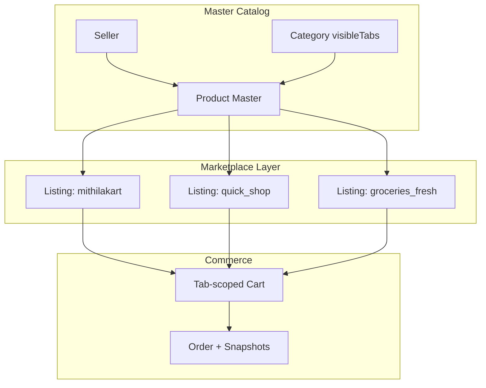

# CR-001 — Updated Marketplace Architecture

**Change Request:** CR-001  
**Date:** 2026-07-20  

---

## 1. Four Shopping Experiences

| # | Marketplace | Tab Key | Delivery | Seller Gate |
|---|---------------|---------|----------|-------------|
| 1 | **Mithilakart** — General Marketplace | `mithilakart` | Standard (location ETA) | All KYC-approved |
| 2 | **Mithilak** — Exclusive Marketplace | `mithilak` | Standard (location ETA) | Admin-approved only |
| 3 | **Quick Shop** — Instant Delivery | `quick_shop` | Fixed: 15/20/25/30 min | Quick-commerce enabled |
| 4 | **Groceries & Fresh** — Quick Commerce | `groceries_fresh` | Fixed: 15/20/25/30 min | Grocery-enabled |

Each experience is a **marketplace tab** — a logical storefront partition backed by `marketplace_listings`.

---

## 2. Core Entity: Marketplace Listing

The listing is the **commercial and delivery contract** between seller and customer for a specific tab.

```
Master Product (1) ──→ Marketplace Listing (N, one per tab)
                              │
                              ├── price, mrp
                              ├── delivery promise (quick only)
                              ├── visibility
                              ├── listing moderation status
                              └── tab-specific promotions
```

---

## 3. Canonical Example

**Master Product:** Aashirvaad Atta 5kg  
**Seller:** ABC Foods  
**Stock:** 500 units (master pool)

| Tab | Listing Price | Delivery | Status |
|-----|---------------|----------|--------|
| Mithilakart | ₹255 | Standard (2-3 days) | Approved |
| Quick Shop | ₹249 | 20 minutes | Approved |
| Groceries & Fresh | ₹245 | 15 minutes | Approved |
| Mithilak | — | — | Not listed |

Customer on Quick Shop sees ₹249 + "Delivery in 20 min".  
Customer on Mithilakart sees ₹255 + standard ETA.  
**One product. Three listings. Zero duplication of master data.**

---

## 4. Marketplace Boundaries

### Data Boundaries

| Data | Scope |
|------|-------|
| Product identity | Global (master) |
| Price | Per listing |
| Delivery promise | Per listing |
| Cart | Per tab |
| Order | Per tab |
| Reviews | Per master product |
| Stock | Master pool (shared) |

### Operational Boundaries

| Concern | Isolation |
|---------|-----------|
| Checkout | Cannot mix tabs |
| Coupons | Tab-scoped |
| Flash sales | Tab-scoped |
| Reports | Tab dimension |
| Serviceability | Per quick tab |

---

## 5. Marketplace Engine (M36)

Replaces M35 Commerce Flow Engine.

**Responsibilities:**
1. Resolve listing for `(productId, marketplaceTab)`
2. Validate seller tab eligibility
3. Validate category visibility on tab
4. Compute listing availability from master stock
5. Enforce delivery model rules
6. Serviceability check for quick tabs

**Does NOT:**
- Handle payment
- Manage auth
- Replace order state machine

---

## 6. `marketplace_config` Collection

Platform-level tab registry:

```javascript
[
  { tab: 'mithilakart', displayName: 'Mithilakart', deliveryModel: 'standard', isActive: true },
  { tab: 'mithilak', displayName: 'Mithilak', deliveryModel: 'standard', sellerEligibility: 'mithilak_approved' },
  { tab: 'quick_shop', displayName: 'Quick Shop', deliveryModel: 'fixed_promise', allowedPromises: [15,20,25,30] },
  { tab: 'groceries_fresh', displayName: 'Groceries & Fresh', deliveryModel: 'fixed_promise', allowedPromises: [15,20,25,30] }
]
```

Seeded at deployment. Admin can toggle `isActive`.

---

## 7. Frontend Route Mapping (Unchanged Routes)

| Frontend Route | marketplaceTab |
|----------------|----------------|
| `/home` | `mithilakart` |
| `/mithilak` | `mithilak` |
| `/quick-shop` | `quick_shop` |
| `/fresh-grocery` | `groceries_fresh` |

Backend serves tab-scoped data; frontend theming remains frontend responsibility.

---

## 8. Comparison: Legacy vs CR-001

| Aspect | Legacy (M35) | CR-001 (M36) |
|--------|--------------|--------------|
| Multi-tab presence | `commerceFlows[]` on product | Separate listing per tab |
| Price | Single on product | Per listing |
| Delivery | Implicit / flow-level | Explicit on listing |
| Moderation | Product-level only | Master + listing |
| Category filter | `commerceFlows[]` | `visibleTabs[]` |
| Cart item ref | productId | listingId |
| Search | Product index | Listing index |

---

## 9. Extension Points

| Future Feature | Hook |
|----------------|------|
| 5th marketplace tab | Add to enum + marketplace_config |
| Dynamic pricing | Listing price rules engine |
| Tab-specific inventory | `stockAllocation` on listing |
| Marketplace-specific variants | Listing → variant mapping |
| B2B wholesale tab | New tab with standard delivery model |

---

## 10. Architecture Diagram


