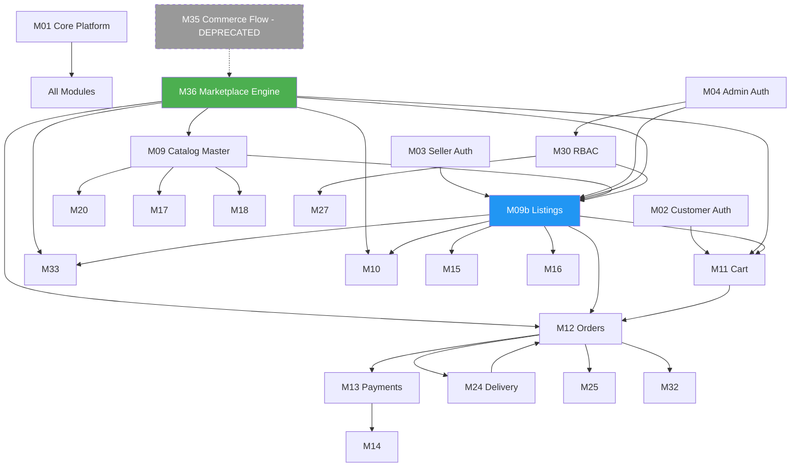

# CR-001 — Updated Module Dependency Graph

**Change Request:** CR-001  
**Date:** 2026-07-20  

---

## 1. Updated Dependency Graph



---

## 2. New Module: M36 — Marketplace Engine

| Attribute | Value |
|-----------|-------|
| **Depends on** | M01, M09 (master product), M09b (listings) |
| **Depended on by** | M10, M11, M12, M15, M16, M33, M24 |
| **Services** | `MarketplaceEngineService`, `ServiceabilityService` |
| **Repositories** | `MarketplaceListingRepository`, `MarketplaceConfigRepository` |

---

## 3. M09 Split

| Sub-module | Scope |
|------------|-------|
| **M09 — Catalog Master** | Categories, master products, variants |
| **M09b — Marketplace Listings** | Listing CRUD, moderation, tab rules |

Documentation remains under M09 in master plan with CR-001 addendum.

---

## 4. Dependency Changes from Baseline

| Module | Old Dependency | New Dependency |
|--------|---------------|----------------|
| M11 Cart | M09 Product | M09b Listing + M36 |
| M12 Orders | M09 Product (price/stock) | M09b Listing snapshot + M09 stock |
| M15 Promotions | M09 Product | M09b Listing |
| M33 Search | M09 Product index | M09b Listing index + M36 |
| M10 CMS | M09 Product refs | M09b Listing refs |
| M24 Delivery | M12 order.commerceFlow | M12 order.marketplaceTab + listing promise |
| M29 Reports | M12 commerceFlow | M12 marketplaceTab |

---

## 5. Implementation Order (Within CR Phases)

```
CR-1a: M36 + marketplace_listings schema + seller listing CRUD
CR-1b: M09 category visibleTabs + admin APIs
CR-2a: M11 cart → listingId
CR-2b: M12 orders → listing snapshots
CR-2c: M33 search reindex
CR-3:  Deprecate commerceFlows, analytics, frontend switch
```

---

## 6. Unchanged Dependency Chains

```
M02–M05 Auth → (all authenticated modules)
M13 Payments → M14 Wallet
M04 Admin + M30 RBAC → all admin modules
M34 File Storage → M09, M10, M06
M32 Notifications → M12 events
```

---

## 7. Critical Path

The **critical path** for CR-001 go-live:

```
marketplace_listings schema
  → seller listing CRUD
  → admin listing moderation
  → customer catalog reads (listing-aware)
  → cart listingId
  → order snapshots
  → search reindex
  → deprecate legacy fields
```

Any break in this chain blocks customer checkout on new model.
