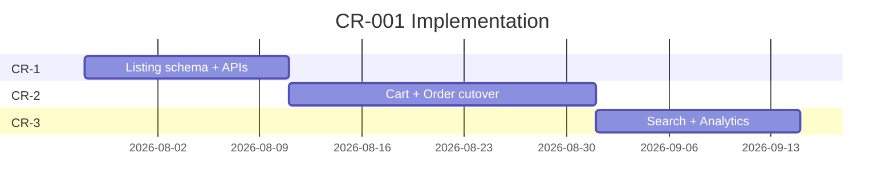

# CR-001 — Updated Implementation Roadmap

**Change Request:** CR-001  
**Date:** 2026-07-20  
**Base:** Implementation Phases 0–10 (completed)  

---

## 1. Phase Impact on Existing Plan

| Original Phase | Impact | Notes |
|----------------|--------|-------|
| Phase 0 — Foundation | NC | No change |
| Phase 1 — Auth | NC | No change |
| Phase 2 — Catalog | **Amended** | Split product/listing; category visibleTabs |
| Phase 3 — Orders/Cart | **Amended** | Listing-aware cart and orders |
| Phase 4 — Seller Portal | **Amended** | Two-step product flow |
| Phase 5 — Delivery | **Amended** | Dual delivery model |
| Phase 6 — Returns/Wallet | Mi | Listing snapshot on returns |
| Phase 7 — Engagement | Mi | Wishlist → listingId |
| Phase 8 — Admin | **Amended** | Listing moderation, tab config |
| Phase 9 — Notifications/Search | **Amended** | Tab-scoped search |
| Phase 10 — Hardening | NC | Rate limit/cache unchanged |

**Phases 0–10 implementation is preserved.** CR-001 adds **Phase CR** sub-phases before frontend go-live on new model.

---

## 2. New Implementation Phases

### Phase CR-1 — Listing Foundation (Est. 2 weeks)

**Goal:** Schema + seller/admin listing CRUD; no customer-facing switch.

| Deliverable | Module |
|-------------|--------|
| `marketplace_listings` collection + model | M09b |
| `marketplace_config` seed | M36 |
| Seller listing CRUD APIs | M09b |
| Admin listing moderation APIs | M09b, M30 |
| Category `visibleTabs[]` migration | M09 |
| MarketplaceEngineService | M36 |
| New RBAC permissions | M30 |
| Unit tests: listing validators, tab rules | QA |

**Exit criteria:** Seller can create master product + listings; admin can approve; no customer API change yet.

---

### Phase CR-2 — Commerce Cutover (Est. 2–3 weeks)

**Goal:** Cart, orders, customer catalog use listings.

| Deliverable | Module |
|-------------|--------|
| Customer catalog returns listing-aware data | M09, M36 |
| Cart → listingId | M11 |
| Order listing snapshots | M12 |
| Pricing from listing | M12, M15 |
| Serviceability API | M36 |
| Delivery promise on order | M12, M24 |
| Data migration script (see Migration Strategy) | Infra |
| Integration tests: multi-tab product checkout | QA |

**Exit criteria:** End-to-end order on quick_shop tab with 20-min promise snapshot.

---

### Phase CR-3 — Search, Analytics & Deprecation (Est. 1–2 weeks)

**Goal:** Full platform on listing model; legacy deprecated.

| Deliverable | Module |
|-------------|--------|
| Search index on listings | M33 |
| Reports by marketplaceTab | M29 |
| Seller dashboard tab split | M19 |
| Wishlist → listingId | M16 |
| CMS listing refs | M10 |
| Deprecation headers on legacy params | API |
| Remove `commerceFlows[]` writes | M09 |
| Frontend integration guide update | Docs |

**Exit criteria:** All customer flows on listing model; legacy fields read-only.

---

## 3. Recommended Sequence

**Total estimate:** 5–7 weeks after CR-001 approval.

---

## 4. Dependency Changes

| Task | Blocked By |
|------|------------|
| Customer catalog listing-aware | CR-1 listing APIs |
| Cart listingId | CR-1 listing schema |
| Order snapshots | CR-2 cart |
| Search reindex | CR-2 customer catalog live |
| Frontend mock replacement | CR-2 E2E passing |
| Legacy field removal | CR-3 + 2 release cycles |

---

## 5. Testing Phase Additions

| Phase | Additional Tests |
|-------|------------------|
| CR-1 | Listing validator matrix; seller eligibility; category visibleTabs |
| CR-2 | Multi-tab product E2E; cart tab mismatch; promise snapshot |
| CR-3 | Search per tab; report dimension; migration verification |

See [14_Testing_Strategy.md](./14_Testing_Strategy.md).

---

## 6. Team Allocation Suggestion

| Role | CR-1 | CR-2 | CR-3 |
|------|------|------|------|
| Backend (Catalog) | Lead | Support | Search |
| Backend (Commerce) | — | Lead | Support |
| Backend (Admin) | Listing moderation | — | Reports |
| QA | Validator tests | E2E flows | Regression |
| DBA | Schema review | Migration run | Index verify |

---

## 7. Go / No-Go Criteria

| Gate | Criteria |
|------|----------|
| CR-1 complete | 100% listing CRUD tests pass; admin moderation works |
| CR-2 complete | Place order on each tab; promise snapshotted correctly |
| CR-3 complete | Search returns tab-scoped results; reports split by tab |
| Production | Migration verified on staging; rollback tested |

---

## 8. What NOT to Do

- Do not rewrite Phases 0–10 from scratch
- Do not change auth, payment gateway, or RBAC framework
- Do not migrate production data before staging validation
- Do not remove legacy `commerceFlows[]` until CR-3 + deprecation period

---

## 9. Documentation Updates Required (Post-Approval)

| Document | Update |
|----------|--------|
| `00_Executive_Summary.md` | Reference CR-001 marketplace model |
| `02_Module_Definitions.md` | M09, M35→M36, M11, M12 |
| `03_Database_Master_Plan.md` | New collection, schema changes |
| `04_API_Master_Plan.md` | Endpoint delta |
| `09_Frontend_Coverage_Matrix.md` | Listing-aware API mapping |
| `docs/backend/FRONTEND_INTEGRATION.md` | Tab context + listing APIs |
